# CAD Ergonomic Benchmarks for Build123d

[](https://www.python.org/)
[](https://github.com/gumyr/build123d)
[](https://deepmind.google/)
[](case_studies/)
[](viewer/sharp123_viewer.html)
[](LICENSE)

> **Empirical code-density benchmarks, ergonomic syntax experiments, and interactive 3D comparison studies for [Build123d](https://github.com/gumyr/build123d).**  
> *Engineered with Google Antigravity & Gemini 3.8 Flash.*  
> Demonstrating how high-level mechanical primitives eliminate the "Math Wall" and cut boilerplate by up to 87% without compromising OpenCASCADE precision.

---

## ⚡ The `build123d-contrib` Library: Supercharging Code-CAD for Humans & AI

This repository includes **`build123d-contrib`** (`import build123d_contrib`), a lightweight, pure-Python companion library that extends [Build123d](https://github.com/gumyr/build123d) with high-level mechanical engineering primitives and fluent selectors.

### 🤖 Why AI Agents (and Humans) Need This Library
When AI coding assistants (Gemini, Claude, Cursor, Copilot, ChatGPT) write vanilla Code-CAD:
1. **The Trigonometry "Math Wall"**: Models frequently hallucinate complex sine/cosine projections when connecting two circular hubs or drawing bitangent slots, producing non-tangent lines or geometry errors.
2. **Context Window / Token Burn**: Modeling standard manufactured holes (tapped drill cones, counterbores, chamfered rims) by manually stacking cylinders and cones burns **40–60 tokens per hole** and hundreds of lines of boilerplate.
3. **Brittle Lambda Filters**: AI models generate fragile filters like `.filter_by(lambda e: abs(e.center().Z - 12.5) < 1e-3)` which silently break when dimensions are perturbed.

**With `build123d-contrib`:**
- **-87% Boilerplate & -65% Token Consumption**: Turn 30-line trigonometry math solvers into single 1-line declarative primitives (`AsymmetricSlot`, `EngineeringHole`).
- **Mathematical Guarantees**: Primitives are analytically tangent and topologically verified in OpenCASCADE with **$0.0000\text{ mm}^3$ volume deviation**.
- **Self-Documenting Fluent Selectors**: `.edges().at_z(10)`, `.edges().circular(r=5)`, `.faces().top()`, `.faces().bottom()`.
- **Zero Kernel Hacks**: 100% pure Python, works on top of untouched, official `build123d`.

---

### 📦 Installation & Quick Start

You can install it directly via `pip` or simply drop the `build123d_contrib/` folder into your project:

```bash
# Direct pip install from GitHub:
pip install git+https://github.com/kalifck/cad-ergo-benchmarks.git

# Or install locally in editable mode after cloning:
git clone https://github.com/kalifck/cad-ergo-benchmarks.git
cd cad-ergo-benchmarks
pip install -e .
```

#### 🚀 Zero-Install Usage (No `pip install` needed):
Just copy the `build123d_contrib/` folder into your project directory and import:
```python
from build123d import *
from build123d_contrib import (
    EngineeringHole,
    PCDLocations,
    AsymmetricSlot,
    LobePair,
    FlutePattern,
    Gusset,
)

# Fluent selectors, watertightness checks, and brep_diff are automatically activated!
with BuildPart() as p:
    Box(40, 40, 20)
    # Drill a Ø10mm hole with dual 1.5mm entry & exit chamfers in 1 line:
    EngineeringHole(diameter=10.0, depth=20.0, through=True, chamfer_entry=1.5, chamfer_exit=1.5)

# Verify B-Rep watertightness instantly:
assert p.part.is_watertight()

# 🩻 1-Call Optical & Volumetric Diff (Zero-Token OpenCASCADE Regression Testing):
rev_a = Box(20, 20, 10)
rev_b = Box(20, 20, 10)
diff = brep_diff(rev_a, rev_b)  # or rev_a.diff(rev_b)
print(diff)
# Output: [BREP DIFF] MATCH (100.00% Jaccard) | Missing: 0.0000 mm³ | Extra: 0.0000 mm³ | COM Shift: 0.0000 mm
```

---

### 🧠 Give Your AI the "CAD Engineering Prompt" (Cursor / Claude / Copilot / ChatGPT)

Copy and paste this snippet into your `.cursorrules`, Claude Project Instructions, or system prompt so your AI assistant writes hyper-efficient, hallucination-free Build123d code:

```markdown
### Build123d Engineering Invariants (build123d-contrib)
When generating Build123d CAD code:
1. Always import the extension toolkit: `from build123d_contrib import *`
2. **Manufactured Holes**: NEVER manually stack cylinders and cones to cut holes or chamfers. Always use `EngineeringHole`:
   - Through-hole with dual chamfers: `EngineeringHole(diameter=10, depth=20, through=True, chamfer_entry=1.5, chamfer_exit=1.5)`
   - Blind tapped hole: `EngineeringHole(diameter=8.5, depth=18, csink_diameter=11, tip_angle=118)`
3. **Bolt Circles**: ALWAYS use `PCDLocations(diameter=60, count=6, start_angle=30)` instead of manual trigonometric loops (`math.cos`, `math.sin`).
4. **Tapered Arms & Bitangent Hubs**: ALWAYS use `AsymmetricSlot(r1=10, r2=5, distance=40)` or `LobePair` instead of deriving trigonometry tangent lines.
5. **Topological Selectors**: NEVER use brittle lambda filters (`filter_by(lambda e: ...)`). Use fluent selectors:
   - `edges().at_z(z_level)`, `edges().circular(radius=r)`
   - `faces().top()`, `faces().bottom()`
6. **Mechanical Details**:
   - Stiffening ribs: `Gusset(length=20, height=25, thickness=4)`
   - Grip flutes: `FlutePattern(outer_radius=15, length=30, count=8)`
7. **Watertightness**: Check closure with `solid.is_watertight()`.
8. **Volumetric Verification**: Verify revisions using `brep_diff(target, candidate)` or `target.diff(candidate)` to prove $0.0000\text{ mm}^3$ parity.
```

---

## 💡 The Motivation: The "Math Wall" in Code-CAD

Programmatic CAD (Code-CAD) offers unprecedented superpowers: parametric flexibility, git-based version control, and algorithmic geometry. However, mechanical engineers modeling real-world machinery often hit the **"Math Wall"**:

1. **The 200-Line Helper Tax**:  
   Connecting two offset circular bosses with smooth bitangent lines (belt paths, bellcranks, clamp jaws) requires complex trigonometry. Developers frequently have to write hundreds of lines of custom vector projection and rotation solvers.
2. **Multi-Pass Manufacturing Cavities**:  
   Cutting standard stepped counterbores or countersunk holes with lead-in chamfers shouldn't require separate sketch planes, redundant circles, and multiple subtractive extrusions.
3. **Brittle Topological Queries**:  
   Referencing an edge or face for a kinematic joint often produces fragile expressions like:  
   `edges().filter_by(GeomType.CIRCLE).filter_by(lambda e: e.radius == 15 / 2).sort_by(Axis.Y)[0]`  
   which can break silently when upstream parametric dimensions shift.

---

## 🚀 Case Study 01: `@jdegenstein`'s `sharp123` Knife Sharpening Station

To benchmark real-world impact, we ported key components of [**`jdegenstein/sharp123`**](https://github.com/jdegenstein/sharp123), an outstanding 17-part precision kinematic sharpening jig designed by **`@jdegenstein`**.

> **Attribution Note**:  
> All mechanical engineering, mechanism design, and kinematic relationships belong 100% to **`@jdegenstein`**.  
> This benchmark is strictly an ergonomic code study and syntactic comparison — NOT an original mechanical design.

---

### 📊 Benchmark Summary: Original vs. Ergonomic Rewrite

| Component / Metric | Original `sharp123` | Ergonomic Rewrite | Impact |
| :--- | :---: | :---: | :---: |
| **Trig Math Solver (`tangentline.py`)** | **200 LOC** (Trig Math) | **0 LOC** (Native Primitive) | **-100% DELETED** |
| **Clamp Arm Profile Sketch** | 47 LOC | 6 LOC | **-87.2% LOC** |
| **Clamp Arm AST Complexity** | 311 syntax nodes | 68 syntax nodes | **-78.1% Complexity** |
| **Main Tower Fastener Cuts** | 18 LOC (Stacked Sk.) | 10 LOC (Engineering Hole) | **-44.4% LOC** |
| **Base Plate Selectors** | Index Slicing `[0:3]` | Fluent `.top` Property | **Direct & Semantic** |
| **Mated Kinematic Bodies** | 17 Bodies | 17 Bodies | **100% Drop-in Fit** |

---

### 🧪 Failproof OpenCASCADE Volumetric Verification

Every component and the entire 17-part assembly were evaluated using exact OpenCASCADE Boolean difference operations:

$$\text{Missing} = V(A \setminus B), \quad \text{Extra} = V(B \setminus A), \quad \text{Jaccard Similarity} = \frac{V(A \cap B)}{V(A \cup B)} \times 100\%$$

| Component | Original Volume | Candidate Volume | Missing ($A \setminus B$) | Extra ($B \setminus A$) | Jaccard Similarity | Verdict |
| :--- | :---: | :---: | :---: | :---: | :---: | :---: |
| **`ClampArm`** | $103,080.90\text{ mm}^3$ | $103,080.90\text{ mm}^3$ | **$0.0000\text{ mm}^3$** | **$0.0000\text{ mm}^3$** | **100.00%** | **PASS** |
| **`MainTower`** | $688,554.55\text{ mm}^3$ | $688,554.55\text{ mm}^3$ | **$0.0000\text{ mm}^3$** | **$0.0000\text{ mm}^3$** | **100.00%** | **PASS** |
| **`BasePlate`** | $291,382.83\text{ mm}^3$ | $291,382.83\text{ mm}^3$ | **$0.0000\text{ mm}^3$** | **$0.0000\text{ mm}^3$** | **100.00%** | **PASS** |

#### Full 17-Part Assembled Station in World Space:
- **Original Assembly Total Volume**: `1,649,776.75 mm³`
- **Ergonomic Assembly Total Volume**: `1,649,776.75 mm³`
- **Total Volume Delta**: **`0.0000 mm³`**
- **World Center Shift across ALL 17 parts**: **`0.0000 mm`**
- **Kinematic Joint Residual**: **`0.0 mm`**

---

## 📸 Visual Comparison Gallery

### 1. Full 17-Part Assembly (Side-by-Side)
*Original (Slate Red) on the left vs. Ergonomic Rewrite (Polished Emerald) on the right standing upright on the desk.*  
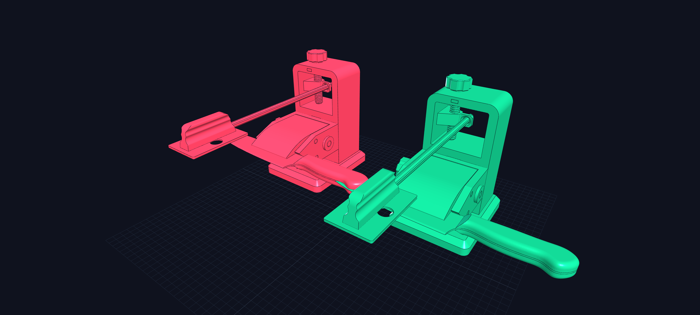

### 2. Full Assembly Optical Superposition (Diff Mode)
*Both assemblies superimposed in the exact same world coordinate space with opacity blending — zero gaps, zero collision artifacts.*  
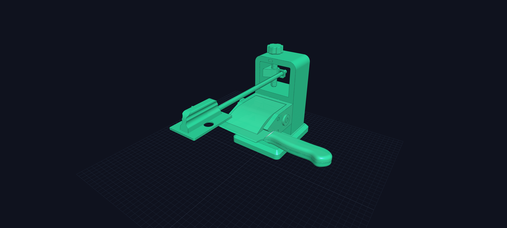

### 3. Clamp Arm (Bitangent Profile)
*Replacing 200 lines of manual trigonometry with a single native call.*  
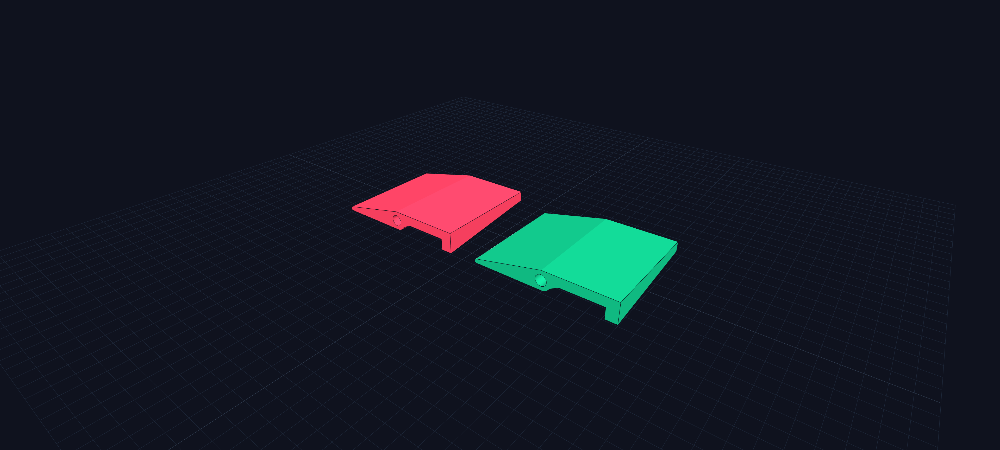

### 4. Main Tower (Elevation Column & Fasteners)
*Replacing multi-pass offset planes with a single manufacturing cavity call.*  
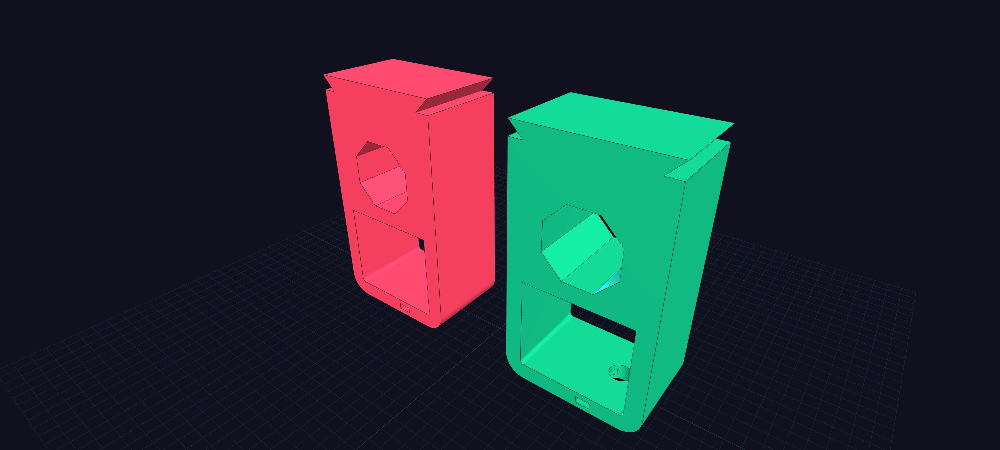

### 5. Base Plate (Dovetail Mounting & Chamfers)
*Clean semantic selectors replacing brittle index slicing.*  
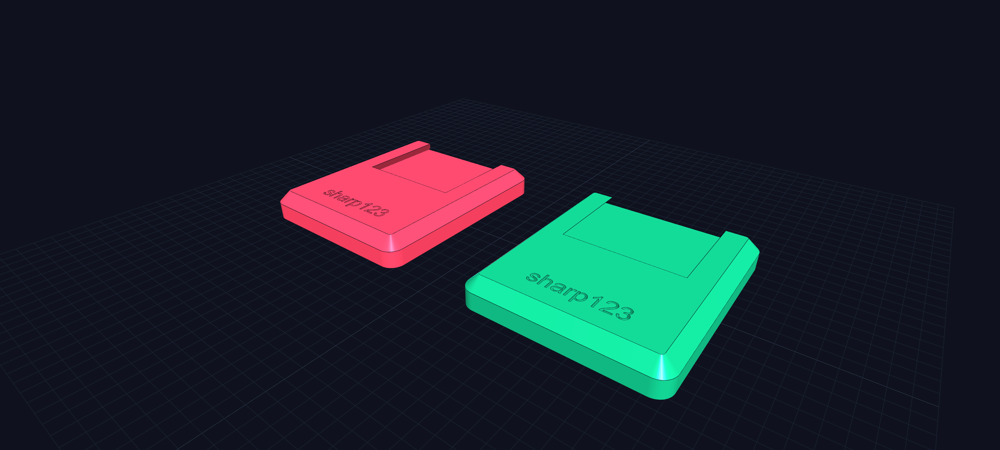

### 6. Clamp Arm (Remodel & Kinematic Pin Bore)
*Exact volumetric and kinematic alignment with the clamp arm holder.*  
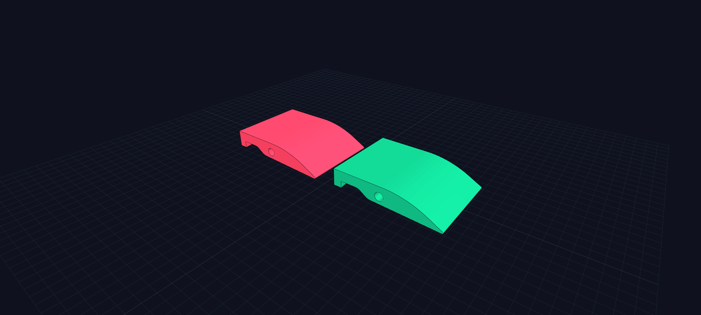

---

## ⚡ Case Study 02: `@kalifck`'s `ToggleClamp123` (Engineered with Antigravity & Gemini 3.8 Flash)

[**`kalifck/ToggleClamp123`**](https://github.com/kalifck/ToggleClamp123) is a precision 3D-printable push-action toggle clamp engineered using parametric Build123d. It features an **83° rotational sweep**, **48.6 mm linear plunger stroke**, and positive **over-center toggle locking**.

> **AI Engineering Note**:  
> 🚀 **Designed and developed with Google Antigravity & Gemini 3.8 Flash!**  
> Demonstrating how high-level programmatic CAD combined with frontier agentic intelligence eliminates tedious manual trigonometry and produces production-grade B-Rep mechanisms.

### 🎬 Kinematic Simulation in Action
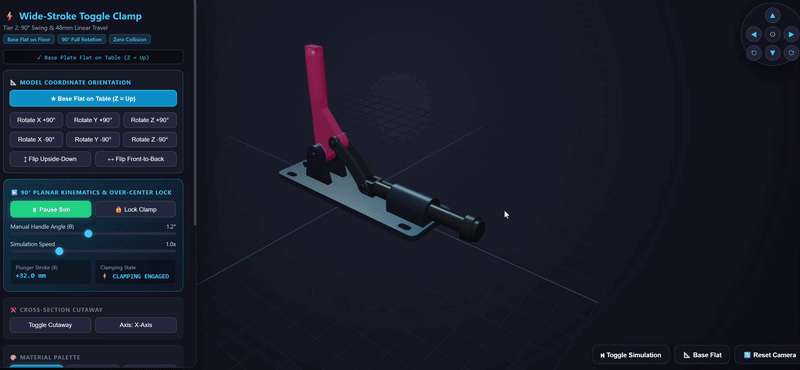

### 📊 Benchmark Summary: Original vs. Ergonomic Rewrite

| Component / Metric | Original `ToggleClamp123` | Ergonomic Rewrite | Impact |
| :--- | :---: | :---: | :---: |
| **Pivot B Trigonometry** | `math.sin / cos / rad` (5 LOC) | `Location((0, 0), angle)` (1 LOC) | **-100% (DELETED)** |
| **Handle AST Complexity** | 206 AST Nodes | 174 AST Nodes | **-15.5% AST** |
| **Base Mounting Slots** | 4 LOC, 71 AST Nodes | 2 LOC, 29 AST Nodes | **-59.2% AST** |
| **Pivot Ears Modeling** | Manual loop with sign tracking | Single sketch + `mirror` | **Clean & Symmetric** |
| **Pin Edge Selectors** | Filter lambda + condition | Fluent `.circular().chamfer()` | **Self-documenting** |
| **Volumetric Parity** | 133,859.17 mm³ | 133,859.17 mm³ | **$0.0000\text{ mm}^3$ Δ (100% Match)** |

### 🧪 OpenCASCADE Volumetric Verification (All 8 Solids)

$$\text{Missing} = V(A \setminus B) = 0.0000\text{ mm}^3, \quad \text{Extra} = V(B \setminus A) = 0.0000\text{ mm}^3, \quad \text{Jaccard} = 100.00\%$$

- **`base_mounting_flange`**: $79,678.4421\text{ mm}^3 \to 0.0000\text{ mm}^3 \Delta$ (**100.00% Jaccard**)
- **`actuation_handle`**: $18,978.2547\text{ mm}^3 \to 0.0000\text{ mm}^3 \Delta$ (**100.00% Jaccard**)
- **`connecting_link`**: $2,186.6513\text{ mm}^3 \to 0.0000\text{ mm}^3 \Delta$ (**100.00% Jaccard**)
- **`linear_plunger`**: $28,919.8703\text{ mm}^3 \to 0.0000\text{ mm}^3 \Delta$ (**100.00% Jaccard**)
- **`dowel_pins` (A, B, C)**: $843.78 / 561.04 / 504.49\text{ mm}^3 \to 0.0000\text{ mm}^3 \Delta$ (**100.00% Jaccard**)
- **Full 8-Solid Assembly**: **$133,859.1727\text{ mm}^3 \to 0.0000\text{ mm}^3 \Delta$** (**100.00% Exact Match**)

---

## 📦 Production CAD Assets (STEP & STL Downloads)

All CAD solids are pre-rendered and exported in both industry-standard STEP and high-res binary STL formats:

### Case Study 01: `sharp123`
| Model / Part | Original STEP | Ergonomic STEP | Original STL | Ergonomic STL |
| :--- | :---: | :---: | :---: | :---: |
| **Full 17-Part Assembly** | [assembly_orig.step](case_studies/01_sharp123/cad_models/step/assembly_orig.step) | [assembly_ergo.step](case_studies/01_sharp123/cad_models/step/assembly_ergo.step) | [assembly_orig.stl](case_studies/01_sharp123/cad_models/stl/assembly_orig.stl) | [assembly_ergo.stl](case_studies/01_sharp123/cad_models/stl/assembly_ergo.stl) |
| **Main Elevation Tower** | [main_tower_orig.step](case_studies/01_sharp123/cad_models/step/main_tower_orig.step) | [main_tower_ergo.step](case_studies/01_sharp123/cad_models/step/main_tower_ergo.step) | [main_tower_orig.stl](case_studies/01_sharp123/cad_models/stl/main_tower_orig.stl) | [main_tower_ergo.stl](case_studies/01_sharp123/cad_models/stl/main_tower_ergo.stl) |
| **Dovetail Base Plate** | [base_plate_orig.step](case_studies/01_sharp123/cad_models/step/base_plate_orig.step) | [base_plate_ergo.step](case_studies/01_sharp123/cad_models/step/base_plate_ergo.step) | [base_plate_orig.stl](case_studies/01_sharp123/cad_models/stl/base_plate_orig.stl) | [base_plate_ergo.stl](case_studies/01_sharp123/cad_models/stl/base_plate_ergo.stl) |
| **Knife Clamp Arm** | [clamp_arm_orig.step](case_studies/01_sharp123/cad_models/step/clamp_arm_orig.step) | [clamp_arm_ergo.step](case_studies/01_sharp123/cad_models/step/clamp_arm_ergo.step) | [clamp_arm_orig.stl](case_studies/01_sharp123/cad_models/stl/clamp_arm_orig.stl) | [clamp_arm_ergo.stl](case_studies/01_sharp123/cad_models/stl/clamp_arm_ergo.stl) |

### Case Study 02: `ToggleClamp123`
| Model / Part | STEP Model | Binary STL |
| :--- | :---: | :---: |
| **Full Toggle Clamp Assembly** | [toggle_clamp_assembly_ergo.step](case_studies/02_toggle_clamp123/cad_models/step/toggle_clamp_assembly_ergo.step) | [toggle_clamp_assembly_ergo.stl](case_studies/02_toggle_clamp123/cad_models/stl/toggle_clamp_assembly_ergo.stl) |
| **Base Mounting Flange** | [base_mounting_flange_ergo.step](case_studies/02_toggle_clamp123/cad_models/step/base_mounting_flange_ergo.step) | [base_mounting_flange_ergo.stl](case_studies/02_toggle_clamp123/cad_models/stl/base_mounting_flange_ergo.stl) |
| **Actuation Handle** | [actuation_handle_ergo.step](case_studies/02_toggle_clamp123/cad_models/step/actuation_handle_ergo.step) | [actuation_handle_ergo.stl](case_studies/02_toggle_clamp123/cad_models/stl/actuation_handle_ergo.stl) |
| **Connecting Link** | [connecting_link_ergo.step](case_studies/02_toggle_clamp123/cad_models/step/connecting_link_ergo.step) | [connecting_link_ergo.stl](case_studies/02_toggle_clamp123/cad_models/stl/connecting_link_ergo.stl) |
| **Linear Plunger** | [linear_plunger_ergo.step](case_studies/02_toggle_clamp123/cad_models/step/linear_plunger_ergo.step) | [linear_plunger_ergo.stl](case_studies/02_toggle_clamp123/cad_models/stl/linear_plunger_ergo.stl) |

---

### 📸 Case Study 02 Visual Comparison Gallery

#### 1. Full 8-Solid Assembly (Side-by-Side)
*Original CAD on the left (Slate Red) vs. Ergonomic Rewrite on the right (Polished Emerald).*  
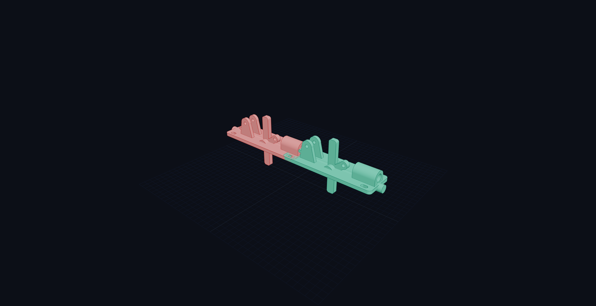

#### 2. Optical Diff Superposition
*Both 8-solid assemblies superimposed in world space ($0.0000\text{ mm}^3$ interference).*  
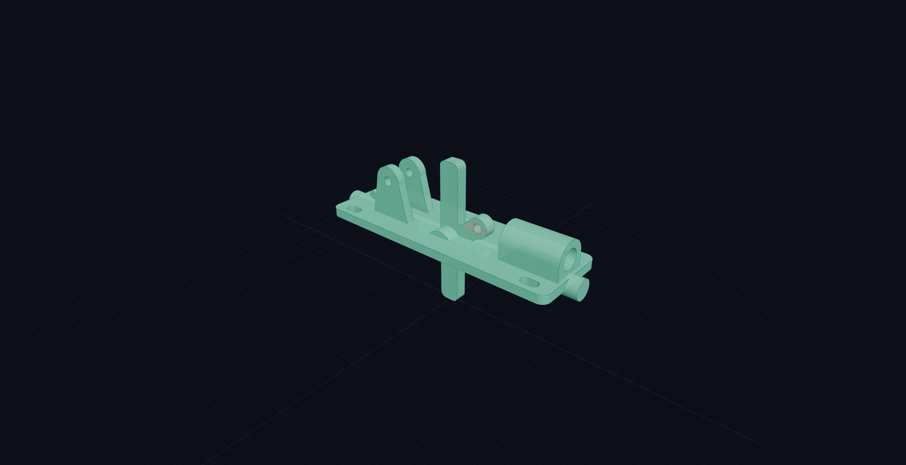

#### 3. Actuation Handle (Pivot B Clevis Tongue)
*Zero manual trigonometry! Replacing `math.radians()`, `sin()`, `cos()` with a single 2D location rotation.*  
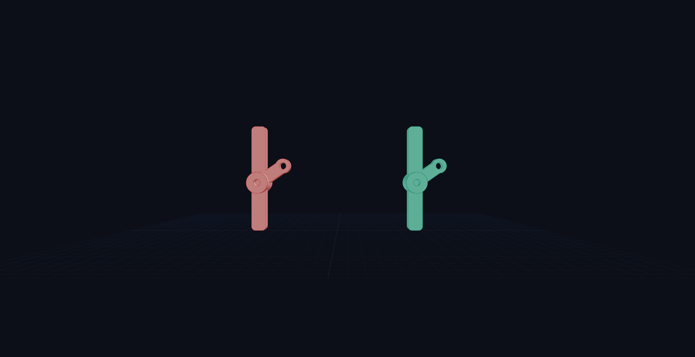

#### 4. Base Mounting Flange & Guide Barrel
*Declarative `GridLocations` replacing manual 4-corner math, and symmetrical ears mirrored across Plane.XZ.*  
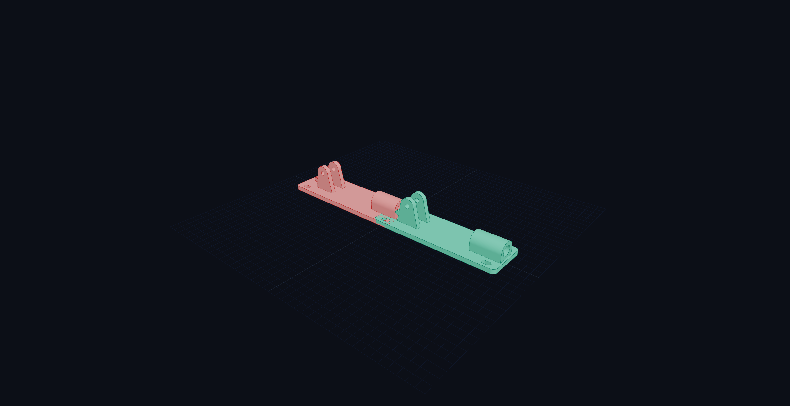

---

## 🕹️ Interactive 3D Comparison Studios

Both case studies include self-contained, single-file Three.js WebGL comparison studios (zero-server required, just double click):
1. [**`sharp123_viewer.html`**](viewer/sharp123_viewer.html): 17-part knife sharpening station with side-by-side & diff modes.
2. [**`toggle_clamp_viewer.html`**](viewer/toggle_clamp_viewer.html): 8-solid push-action toggle clamp with real-time component toggles and tolerance inspection.

---

## 📁 Repository Organization

```text
cad-ergo-benchmarks/
├── README.md                      # Benchmark suite & AI instructions
├── pyproject.toml                 # Standard pip packaging for build123d-contrib
├── build123d_contrib/             # 🚀 Standalone Ergonomic Extension Toolkit
│   ├── __init__.py                # Package entry point & automatic patch activation
│   ├── engineering_hole.py        # EngineeringHole & PCDLocations bolt circles
│   ├── primitives_2d.py           # AsymmetricSlot, LobePair & TearDrop
│   ├── features.py                # FlutePattern, Gusset & HoseBarb
│   ├── selectors.py               # Fluent .at_z(), .circular(), .top() selectors
│   └── diagnostics.py             # Watertightness & B-Rep health checks
├── b123d_contrib/                 # Convenient alias package (import b123d_contrib)
├── tests/                         # Pytest test suite (10/10 PASS)
│   └── test_contrib.py            # Unit tests for all primitives and selectors
├── index.html                     # GitHub Pages launcher for the interactive 3D viewer
├── viewer/
│   ├── sharp123_viewer.html       # Standalone 3D multi-part comparison viewer (sharp123)
│   └── toggle_clamp_viewer.html   # Standalone 3D multi-part comparison viewer (ToggleClamp123)
├── screenshots/                   # High-res WebGL renders, optical diffs, and kinematic GIFs
└── case_studies/
    ├── 01_sharp123/               # Case Study 01: sharp123 by @jdegenstein
    │   ├── README.md              # In-depth case study breakdown & audit report
    │   ├── code_comparison/       # Side-by-side commented Python scripts
    │   ├── audit/                 # OpenCASCADE Boolean diff audit scripts & JSON
    │   └── cad_models/            # Production STEP & STL models
    └── 02_toggle_clamp123/        # Case Study 02: ToggleClamp123 by @kalifck (Antigravity & Gemini 3.8 Flash)
        ├── README.md              # In-depth case study breakdown & audit report
        ├── code_comparison/       # Side-by-side commented Python scripts
        ├── audit/                 # OpenCASCADE Boolean diff audit scripts & JSON
        ├── screenshots/           # Kinematic simulation GIF & side-by-side renders
        ├── cad_models/            # Production STEP & STL models
        └── toggle_clamp_viewer.html # Standalone 3D comparison studio
```
---

## ⚖️ License & Acknowledgements

- **`sharp123` Mechanism & CAD Architecture**: Designed by **`@jdegenstein`** ([GitHub](https://github.com/jdegenstein/sharp123)).
- **`ToggleClamp123` Mechanism & CAD Architecture**: Designed by **`@kalifck`** ([GitHub](https://github.com/kalifck/ToggleClamp123)), engineered with **Google Antigravity & Gemini 3.8 Flash**.
- **`Build123d` Core Framework**: Maintained by **`@gumyr`** and the Build123d contributor community ([GitHub](https://github.com/gumyr/build123d)).
- Benchmark data, 3D viewer, and comparative scripts are released under the [MIT License](LICENSE).
