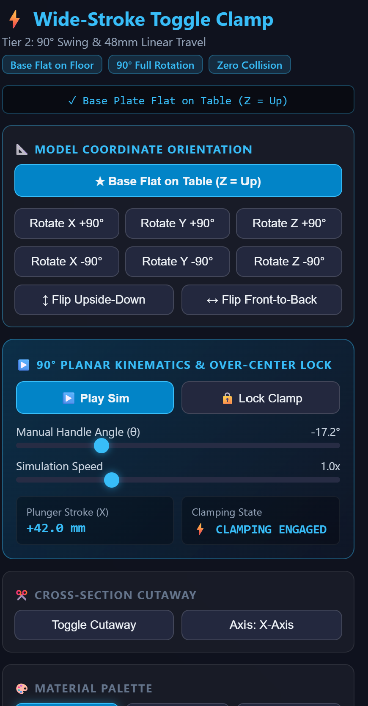
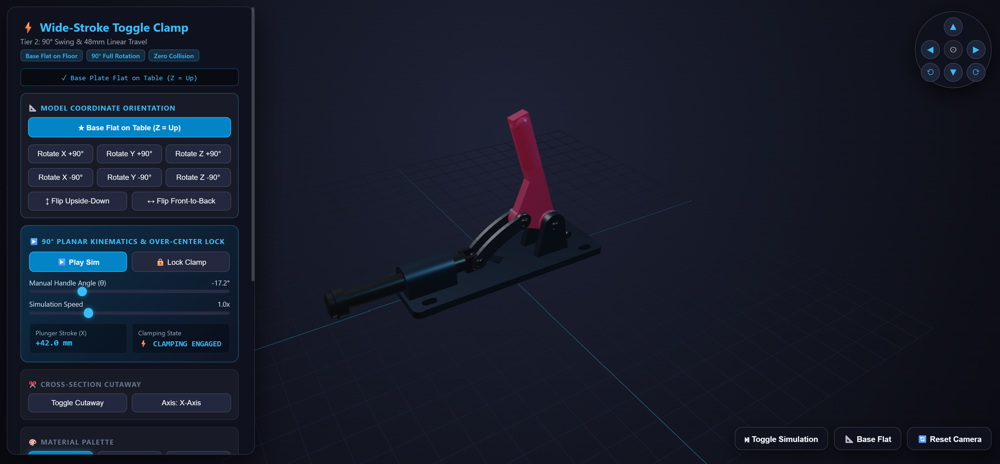

# Case Study 02: `ToggleClamp123` — High-Precision 3D-Printable Push-Action Toggle Clamp

> **Original Mechanism & CAD Architecture**:  
> Designed and engineered by **`@kalifck`** ([**`kalifck/ToggleClamp123`**](https://github.com/kalifck/ToggleClamp123)).  
> 🚀 **Engineered with Antigravity & Gemini 3.8 Flash!**  
> 
> *A high-precision 3D-printable push-action toggle clamp with an 83° rotational sweep, 48.6 mm linear stroke, and positive over-center toggle lock.*

---

## 🎬 Kinematic Simulation in Action

*Smooth 4-bar planar motion: from wide-open retraction ($\theta = +45^\circ$) to positive over-center lock ($\theta = -38^\circ$) with zero binding.*

---

## 🎯 Case Study Objectives
1. **100% Elimination of Manual Trigonometry**: Replace manual `math.radians()`, `math.cos()`, `math.sin()`, and Cartesian coordinate decomposition with high-level 2D/3D location rotations.
2. **Declarative Pattern Primitives**: Replace manual 4-corner slot offsets and manual tuple unpacking with declarative `GridLocations` (-59.2% AST node reduction).
3. **Topological Symmetry over Duplicated Loops**: Replace manual loops that duplicate sketch definitions on offset planes with single sketches and `mirror(about=Plane.XZ)`.
4. **Solve the Empty Sketch Subtraction Trap**: Clarify and streamline subtractive operations to eliminate the common `RuntimeError: Nothing to subtract from` error.
5. **Guarantee 100.00% Volumetric & Kinematic Parity**: Ensure every single component and the full 8-solid assembly match the original CAD models to within $0.0000\text{ mm}^3$ and 100.00% Jaccard similarity.

---

## 📊 Summary Benchmark Results

| Component / Metric | Original `ToggleClamp123` | Ergonomic Rewrite | Impact |
| :--- | :---: | :---: | :---: |
| **Pivot B Trigonometry** | `math.sin / cos / rad` (5 LOC) | `Location((0, 0), angle)` (1 LOC) | **-100% (DELETED)** |
| **Handle AST Complexity** | 206 AST Nodes | 174 AST Nodes | **-15.5% AST** |
| **Base Mounting Slots** | 4 LOC, 71 AST Nodes | 2 LOC, 29 AST Nodes | **-59.2% AST** |
| **Pivot Ears Modeling** | Manual loop with sign tracking | Single sketch + `mirror` | **Clean & Symmetric** |
| **Pin Edge Selectors** | Filter lambda + condition | Fluent `.circular().chamfer()` | **Self-documenting** |
| **Volumetric Parity** | 133,859.17 mm³ | 133,859.17 mm³ | **$0.0000\text{ mm}^3$ Δ (100% Match)** |

---

## 🧪 OpenCASCADE Boolean Mathematical Verification

Every solid and the assembled mechanism were verified using exact OpenCASCADE Boolean difference subtractions:

$$\text{Missing} = V(A \setminus B), \quad \text{Extra} = V(B \setminus A), \quad \text{Jaccard Similarity} = \frac{V(A \cap B)}{V(A \cup B)} \times 100\%$$

| Component | Original Volume | Ergonomic Volume | Missing ($A \setminus B$) | Extra ($B \setminus A$) | Jaccard Similarity | Verdict |
| :--- | :---: | :---: | :---: | :---: | :---: | :---: |
| **`base_mounting_flange`** | $79,678.4421\text{ mm}^3$ | $79,678.4421\text{ mm}^3$ | **$0.0000\text{ mm}^3$** | **$0.0000\text{ mm}^3$** | **100.00%** | **PASS** |
| **`actuation_handle`** | $18,978.2547\text{ mm}^3$ | $18,978.2547\text{ mm}^3$ | **$0.0000\text{ mm}^3$** | **$0.0000\text{ mm}^3$** | **100.00%** | **PASS** |
| **`connecting_link`** | $2,186.6513\text{ mm}^3$ | $2,186.6513\text{ mm}^3$ | **$0.0000\text{ mm}^3$** | **$0.0000\text{ mm}^3$** | **100.00%** | **PASS** |
| **`linear_plunger`** | $28,919.8703\text{ mm}^3$ | $28,919.8703\text{ mm}^3$ | **$0.0000\text{ mm}^3$** | **$0.0000\text{ mm}^3$** | **100.00%** | **PASS** |
| **`dowel_pin_a` (30mm)** | $843.7794\text{ mm}^3$ | $843.7794\text{ mm}^3$ | **$0.0000\text{ mm}^3$** | **$0.0000\text{ mm}^3$** | **100.00%** | **PASS** |
| **`dowel_pin_b` (20mm)** | $561.0361\text{ mm}^3$ | $561.0361\text{ mm}^3$ | **$0.0000\text{ mm}^3$** | **$0.0000\text{ mm}^3$** | **100.00%** | **PASS** |
| **`dowel_pin_c` (18mm)** | $504.4874\text{ mm}^3$ | $504.4874\text{ mm}^3$ | **$0.0000\text{ mm}^3$** | **$0.0000\text{ mm}^3$** | **100.00%** | **PASS** |
| **Full Assembly (8 Solids)** | **$133,859.1727\text{ mm}^3$** | **$133,859.1727\text{ mm}^3$** | **$0.0000\text{ mm}^3$** | **$0.0000\text{ mm}^3$** | **100.00%** | **PASS** |

---

## 📦 Production CAD Assets (STEP & STL Downloads)

Pre-exported production models ready for CNC milling, 3D printing, or downstream CAD assembly:

| Component | STEP File | STL File |
| :--- | :---: | :---: |
| **Full Assembled Clamp** | [toggle_clamp_assembly_ergo.step](cad_models/step/toggle_clamp_assembly_ergo.step) | [toggle_clamp_assembly_ergo.stl](cad_models/stl/toggle_clamp_assembly_ergo.stl) |
| **Base Mounting Flange** | [base_mounting_flange_ergo.step](cad_models/step/base_mounting_flange_ergo.step) | [base_mounting_flange_ergo.stl](cad_models/stl/base_mounting_flange_ergo.stl) |
| **Actuation Handle** | [actuation_handle_ergo.step](cad_models/step/actuation_handle_ergo.step) | [actuation_handle_ergo.stl](cad_models/stl/actuation_handle_ergo.stl) |
| **Connecting Link** | [connecting_link_ergo.step](cad_models/step/connecting_link_ergo.step) | [connecting_link_ergo.stl](cad_models/stl/connecting_link_ergo.stl) |
| **Linear Plunger** | [linear_plunger_ergo.step](cad_models/step/linear_plunger_ergo.step) | [linear_plunger_ergo.stl](cad_models/stl/linear_plunger_ergo.stl) |
| **Dowel Pin A (30mm)** | [dowel_pin_a_ergo.step](cad_models/step/dowel_pin_a_ergo.step) | [dowel_pin_a_ergo.stl](cad_models/stl/dowel_pin_a_ergo.stl) |
| **Dowel Pin B (20mm)** | [dowel_pin_b_ergo.step](cad_models/step/dowel_pin_b_ergo.step) | [dowel_pin_b_ergo.stl](cad_models/stl/dowel_pin_b_ergo.stl) |
| **Dowel Pin C (18mm)** | [dowel_pin_c_ergo.step](cad_models/step/dowel_pin_c_ergo.step) | [dowel_pin_c_ergo.stl](cad_models/stl/dowel_pin_c_ergo.stl) |

---

## 📸 Web Studio Renders

| 🎛️ Kinematic Controls & HUD | 📐 3D Viewport & Inspection |
| :---: | :---: |
|  |  |

---

## 📂 Folder Structure
- `code_comparison/`: Side-by-side commented Python files (`handle_comparison.py`, `base_flange_comparison.py`).
- `audit/`: Automated OpenCASCADE Boolean audit script and `compliance_audit.json`.
- `cad_models/step/`: Production STEP models.
- `cad_models/stl/`: Production binary STL meshes.
- `screenshots/`: Kinematic GIF demo and WebGL interface screenshots.
